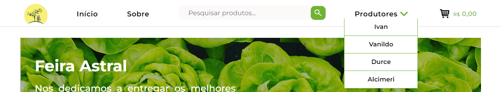
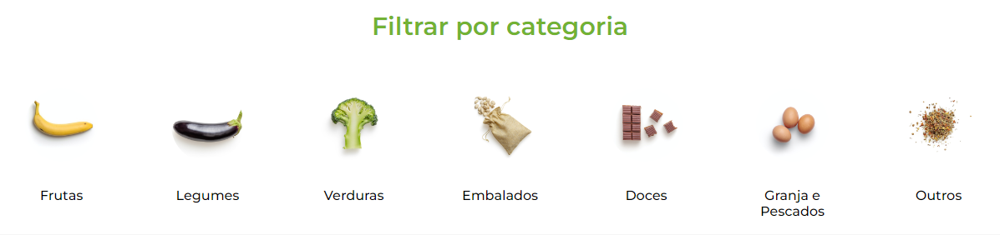
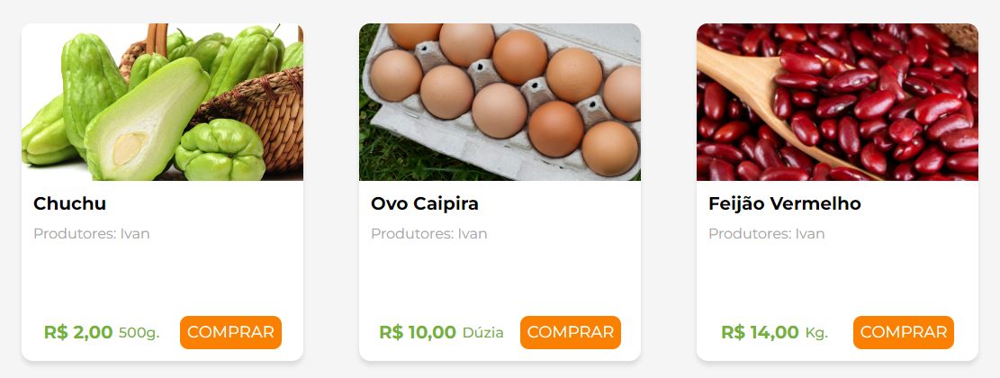

Home
====

Na página de Home ou Início estão disponíveis todos os produtos ofertados em nossa feira, através desta é possível escolher a
quantia de produtos que será colocada no carrinho, para a posterior confirmação da compra. Também se pode dividir os produtos por categoria e por produtor. Abaixo estão algumas das principais funcionalidades da presente página:

=======
Header
=======

No cabeçalho do site está presente uma barra de navegação que direciona os usuários para as páginas Sobre e Carrinho. Também há a opção de pesquisar um produto através da barra de pesquisa e selecionar produtos de produtores específicos através do filtro.

======================
Filtrar por Categoria
======================

Nesta seção da Home é possível filtrar os produtos por categoria, como frutas e legumes. Essa filtragem pode ser feita por uma ou mais categorias.

===============
Card de Produto
===============

É através dessa seção que o cliente fará a seleção dos produtos que deseja colocar no carrinho. É possível selecionar de um produto até a sua quantia disponível.

