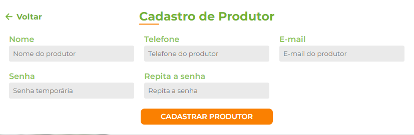
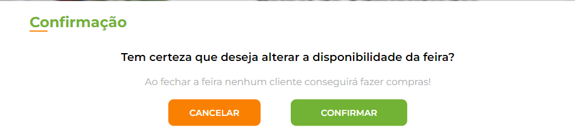
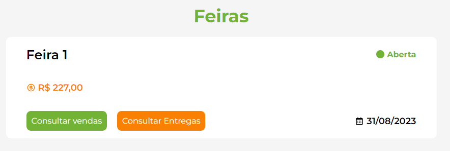
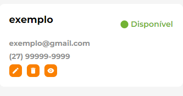

Painel do Admin
===============

No painel do administrador, o administrador temos 3 opções para utilizar, a opção de cadastrar uma nova feira, a de cadastrar um produtor a de abrir/fechar feira.

===========
Nova Feira
===========

Ao clicar em nova feira, é aberta uma sessão onde é colocado o valor da taxa de entrega da feira que irá ser cadastrada e esse será o valor cobrado para as entregas desta feira.

==================
Cadastrar Produtor
==================

Já no botão de cadastrar produtor, abre-se uma sessão com campos parar cadastrar um produtor, nestes campos estão: Nome, Telefone, E-mail, Senha e Repetir Senha.

==================
Abrir/Fechar Feira
==================

Ao clicar na opção de abrir ou fechar feira, é mostrado um campo de confirmação, para ter a certeza que quer fechar ou abrir a feira, já que enquanto a feira estiver fechada, nenhum usuário tem acesso para comprar os produtos.

======
Vendas
======

No painel do administrador é possível clicar em consultar todas as vendas e entregas para poder ver as vendas e entregas de determinada feira.

==========
Produtores
==========

Além disso, o administrador possui uma aba com acesso a todos os produtores, onde se pode editar algumas informações do prodoutor e também é possível deletar um produtor ou torná-lo indisponível para a feira.

Clicando no lápis, é possível editar o nome, email e telefone do protudor.

.. figure:: _media/paineladmineditarprodutor.png

Clicando na lixeira, existe a opção de excluir algum produtor.

Clicando no olho, é possível deixar o produtor indisponível para caso ele não possa participar da feira.

